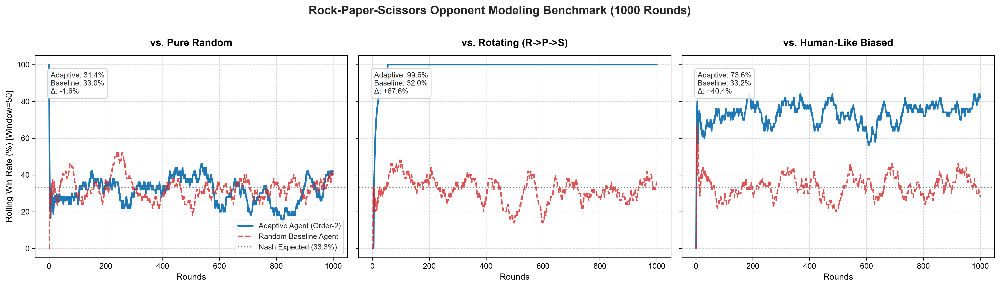
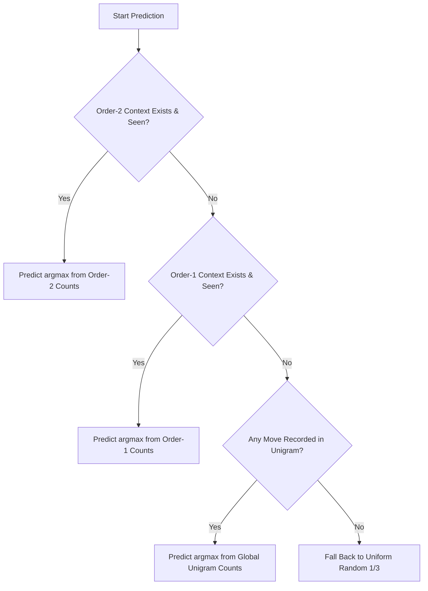

# RPS Opponent Modeling: Adaptive Markov Agent

An adaptive, pure-Python Rock-Paper-Scissors (RPS) agent that exploits non-random opponent patterns using an **Order-$N$ Markov Chain with Hierarchical Backoff**.



---

## 1. Problem

In standard Rock-Paper-Scissors game theory, the unique Nash equilibrium strategy is **uniform random play** ($P(R) = P(P) = P(S) = \frac{1}{3}$), yielding an expected win rate of exactly $33.\overline{3}\%$.

However, human players and non-optimal automated agents exhibit systematic cognitive and behavioral biases:
1. **Marginal Move Imbalance (Unigram Bias)**: Humans favor Rock significantly more often than Paper or Scissors (often ~40–50% Rock).
2. **Transition / Streak Bias (Markov Bias)**: Humans rarely select moves independently across rounds; they tend to repeat winning choices (win-stay/lose-shift) or avoid repeating the same move three times in a row.
3. **Cyclic Patterns**: Programmed bots or naive players frequently cycle through moves in fixed sequences ($R \to P \to S$).

The goal of this project is to build an online adaptive agent that dynamically infers the opponent's strategy distribution and plays the optimal counter-move to maximize expected utility.

---

## 2. Approach

### Markov Pattern Modeling with Backoff

The agent maintains an $N$-gram transition model tracking the conditional probability distribution of the opponent's next move given their recent move history:

$$P(M_t = m \mid M_{t-1}, M_{t-2}, \dots, M_{t-N})$$

By default, an **Order-2 Markov Chain** ($N=2$) is employed:

```
[Opponent Move t-2, Opponent Move t-1] ──> Predicted Opponent Move t ──> Counter-Move
```

### Hierarchical Backoff Mechanism

When operating online from round 1, data sparsity is a primary challenge. The agent resolves this through a **classic backoff hierarchy**:



1. **Order-2 ($k=2$)**: Check if the last 2 opponent moves `(m_{t-2}, m_{t-1})` exist in the transition frequency table. If observed, pick the move with the highest transition frequency $\arg\max_m C(m_{t-2}, m_{t-1}, m)$.
2. **Order-1 ($k=1$)**: If the order-2 context has no historical transitions, back off to order-1 conditional counts given `(m_{t-1},)`.
3. **Unigram Frequency ($k=0$)**: If order-1 has no matching context, fall back to global marginal move counts across the entire match.
4. **Uniform Random**: If no moves have been observed yet (round 1), sample uniformly at random: $P(m) = \frac{1}{3}$.

### Optimal Counter-Move Selection

Once the opponent's most probable next move $\hat{m}_t$ is predicted, the agent executes the winning counter-action:

$$\text{Action} = \text{Counter}(\hat{m}_t) = \begin{cases} \text{Paper} & \text{if } \hat{m}_t = \text{Rock} \\ \text{Scissors} & \text{if } \hat{m}_t = \text{Paper} \\ \text{Rock} & \text{if } \hat{m}_t = \text{Scissors} \end{cases}$$

---

## 3. Project Structure

```
rps-opponent-modeling/
├── src/
│   └── rps_agent.py         # Markov OpponentModel, agents, opponents, simulation & plotting
├── tests/
│   └── test_agent.py        # Pytest test suite for logic, backoff, and statistical win rates
├── docs/
│   └── winrate_plot.png     # Benchmark rolling win-rate visualization
├── README.md                # Project documentation & benchmark findings
├── requirements.txt         # Project dependencies (numpy, matplotlib, pytest)
├── .gitignore               # Standard Python gitignore rules
└── LICENSE                  # MIT License
```

---

## 4. How to Run

### Installation

Clone the repository and install the lightweight dependencies:

```bash
pip install -r requirements.txt
```

### Option A: Launch Interactive Web App & Localhost Server (Recommended)

Run the server or double-click `run.bat`:

```bash
python src/server.py
```

Then open **[http://localhost:5000](http://localhost:5000)** in your web browser. Features include:
- Interactive Rock/Paper/Scissors buttons with keyboard hotkeys (`R`, `P`, `S`).
- Real-time Scoreboard with live win-rate counters.
- AI internal prediction & counter-move breakdown.
- Live Markov Chain transition matrix visualizer.
- Live match history table and embedded 1000-round benchmark chart.

---

### Option B: Run Benchmark Simulation & Generate Plot

Execute the full 1,000-round benchmark simulation per opponent and save `docs/winrate_plot.png`:

```bash
python src/rps_agent.py
```

#### CLI Options:
- `--rounds`: Number of simulation rounds per matchup (default: `1000`).
- `--order`: Markov chain context order (default: `2`).
- `--seed`: Random seed for deterministic reproducibility (default: `42`).
- `--plot-path`: Destination path for the plot (default: `docs/winrate_plot.png`).
- `-i`, `--interactive`: Launch an interactive live terminal console match against the AI.

Example commands:
```bash
# Run benchmark simulation and export plot
python src/rps_agent.py

# Custom simulation parameters
python src/rps_agent.py --rounds 2000 --order 2 --seed 123

# Interactive terminal match
python src/rps_agent.py -i
```

### Running Tests

Run the test suite with `pytest`:

```bash
python -m pytest -v
```

---

## 5. Sample Output & Benchmark Results

Actual console output generated by executing `python src/rps_agent.py --rounds 1000 --order 2 --seed 42`:

```text
====================================================================================================
  RPS OPPONENT MODELING BENCHMARK RESULTS (Rounds: 1000, Markov Order: 2, Seed: 42)
====================================================================================================
+------------------------+----------------+----------------+----------------+----------------+----------------+
| Opponent Strategy      |  Adaptive Win% | Adaptive Loss% |  Adaptive Tie% | Random Base Win% |     Delta Win% |
+------------------------+----------------+----------------+----------------+----------------+----------------+
| Pure Random            |          31.4% |          34.6% |          34.0% |          33.0% |          -1.6% |
| Rotating (R->P->S)     |          99.6% |           0.1% |           0.3% |          32.0% |         +67.6% |
| Human-Like Biased      |          73.6% |          12.5% |          13.9% |          33.2% |         +40.4% |
+------------------------+----------------+----------------+----------------+----------------+----------------+
 Note: Delta Win% = (Adaptive Agent Win Rate) - (Random Baseline Agent Win Rate)

[Plot Saved] Visualization successfully exported to: docs/winrate_plot.png
```

### Performance Analysis:
1. **vs. Pure Random Opponent**:
   - **Adaptive Win Rate**: `31.4%` (approx $\frac{1}{3}$).
   - **Random Baseline Win Rate**: `33.0%`.
   - **Key Finding**: Pure uniform random play cannot be exploited by pattern modeling, aligning with game-theoretic Nash equilibrium predictions.
2. **vs. Rotating (R $\to$ P $\to$ S) Opponent**:
   - **Adaptive Win Rate**: `99.6%` (near 100%).
   - **Random Baseline Win Rate**: `32.0%`.
   - **Delta Win Rate**: `+67.6%`.
   - **Key Finding**: The Markov model learns the transition sequence after only 2 moves and wins essentially every subsequent round.
3. **vs. Human-Like Biased Opponent (50/30/20 with Streak Bias)**:
   - **Adaptive Win Rate**: `73.6%`.
   - **Random Baseline Win Rate**: `33.2%`.
   - **Delta Win Rate**: `+40.4%`.
   - **Key Finding**: Exploitation of streak persistence and marginal frequency asymmetry yields an overwhelming +40.4% win-rate advantage over random play.

---

## 6. Visualization

The rolling win-rate plot (window size = 50 rounds) is saved in [`docs/winrate_plot.png`](docs/winrate_plot.png).

It clearly illustrates:
- **Rapid Convergence**: The adaptive agent reaches near-100% win rate within 5 rounds against deterministic cycles.
- **Sustained Superiority**: A stable ~75% rolling win rate against human-like non-stationary biased opponents.
- **Baseline Equivalence**: Convergence to the 33.3% Nash reference line against pure random noise.

---

## 7. License

This project is licensed under the [MIT License](LICENSE).
